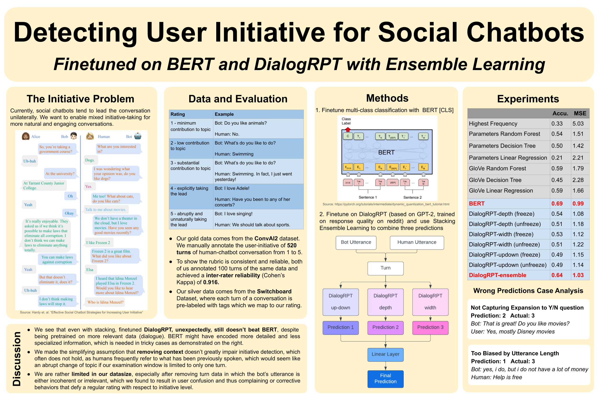

This is my final project with [Jack Liu](https://profiles.stanford.edu/jiayi-liu) for the Winter 2022 offering of [CS224N: Natural Language Processing with Deep Learning](https://web.stanford.edu/class/archive/cs/cs224n/cs224n.1224/) at Stanford.

Mixed initiative, or two parties taking turns leading the conversation, is an important feature of human-human conversations, but one that social chatbots have difficulty with. In this project, we train a neural model that detects the user' initiative level, as a basis for the future task of conditioning bot response on user initiative. We have annotated our own data and finetuned two pretrained models, BERT and DialogRPT, the latter with stacking ensemble learning. Our models achieve moderate improvement over the baseline. We discuss the limitations of our models in detail and lay out a plan for future work.

A more detailed write-up can be found [here](https://web.stanford.edu/class/archive/cs/cs224n/cs224n.1224/reports/custom_116829161.pdf).
